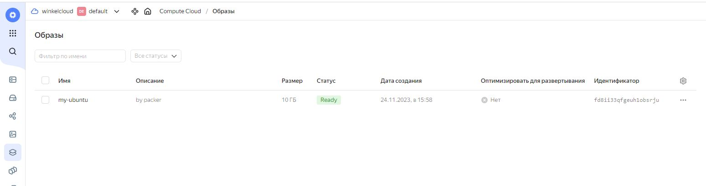
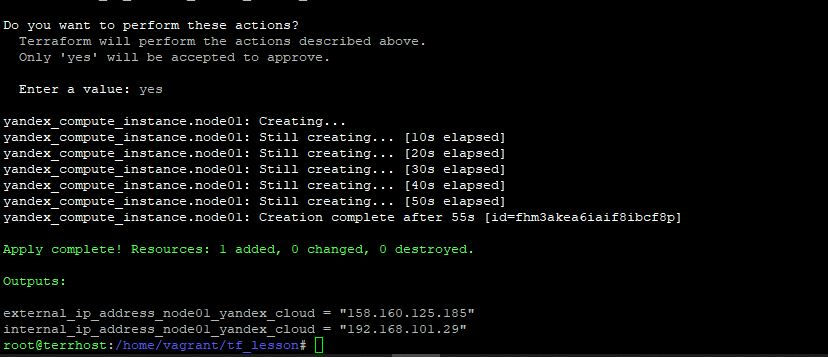
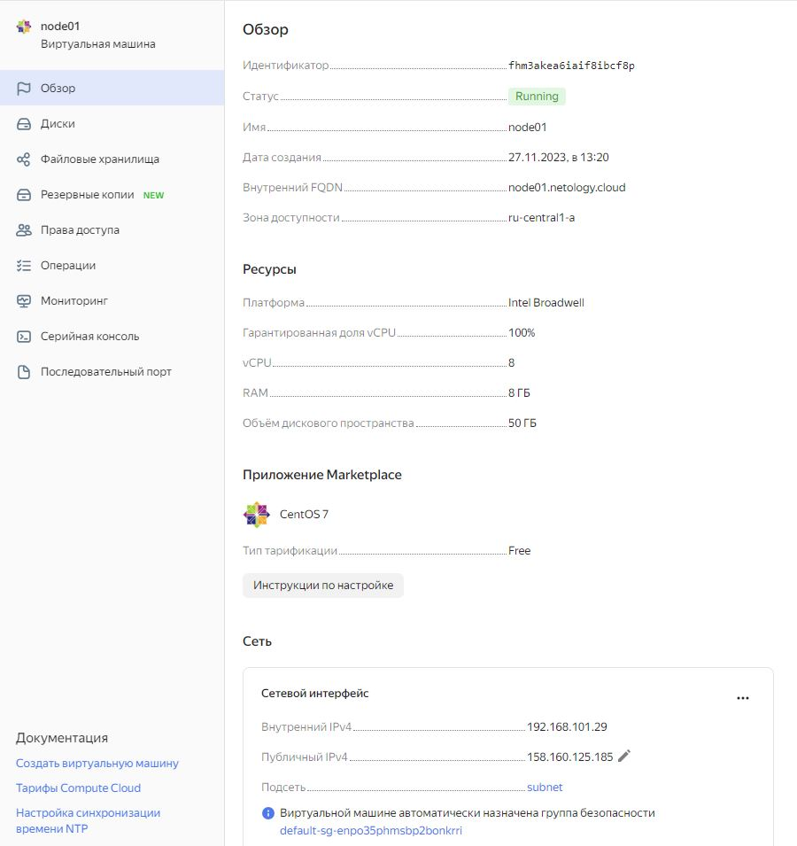

# Домашнее задание к занятию 4. «Оркестрация группой Docker-контейнеров на примере Docker Compose», Лебедев А.И., fops-10


## Задача 1


Создайте собственный образ любой операционной системы (например, debian-11) с помощью Packer версии 1.7.0 . Перед выполнением задания изучите ([инструкцию!!!](https://cloud.yandex.ru/docs/tutorials/infrastructure-management/packer-quickstart)). В инструкции указана минимальная версия 1.5, но нужно использовать 1.7, так как там есть нужный нам функционал


Чтобы получить зачёт, вам нужно предоставить скриншот страницы с созданным образом из личного кабинета YandexCloud.  

### Решение:  

- Для начала установим утилиту для работы с YC и проверим, что она работает:

```
root@elastic:/home/vagrant# curl -sSL https://storage.yandexcloud.net/yandexcloud-yc/install.sh | bash
Downloading yc 0.113.0
  % Total    % Received % Xferd  Average Speed   Time    Time     Time  Current
                                 Dload  Upload   Total   Spent    Left  Speed
100  109M  100  109M    0     0  5670k      0  0:00:19  0:00:19 --:--:-- 5726k
Yandex Cloud CLI 0.113.0 linux/amd64

yc PATH has been added to your '/root/.bashrc' profile
yc bash completion has been added to your '/root/.bashrc' profile.
Now we have zsh completion. Type "echo 'source /root/yandex-cloud/completion.zsh.inc' >>  ~/.zshrc" to install itTo complete installation, start a new shell (exec -l $SHELL) or type 'source "/root/.bashrc"' in the current one
root@elastic:/home/vagrant# ls
1150  ansible_docker  cd  docker_project  elastic_docker_project  packer
root@elastic:/home/vagrant# yc init
bash: yc: command not found
root@elastic:/home/vagrant# ls /root/yandex-cloud/bin/
docker-credential-yc  yc
root@elastic:/home/vagrant# cp /root/yandex-cloud/bin/ /usr/bin
cp: -r not specified; omitting directory '/root/yandex-cloud/bin/'
root@elastic:/home/vagrant# yc init
bash: yc: command not found
root@elastic:/home/vagrant# cp /root/yandex-cloud/bin/yc /usr/bin
root@elastic:/home/vagrant# yc init
Welcome! This command will take you through the configuration process.
Please go to https://oauth.yandex.ru/authorize?response_type=token&client_id=1a6990aa636648e9b2ef855fa7***** in order to obtain OAuth token.

Please enter OAuth token: =-my OATH token=-
You have one cloud available: 'winkelcloud' (id = b1g4oas************). It is going to be used by default.
Please choose folder to use:
 [1] default (id = b1g533merod***********)
 [2] Create a new folder
Please enter your numeric choice: 1
Your current folder has been set to 'default' (id = b1g533me**********).
Do you want to configure a default Compute zone? [Y/n] y
Which zone do you want to use as a profile default?
 [1] ru-central1-a
 [2] ru-central1-b
 [3] ru-central1-c
 [4] ru-central1-d
 [5] Don't set default zone
Please enter your numeric choice: 1
Your profile default Compute zone has been set to 'ru-central1-a'.
root@elastic:/home/vagrant# yc compute image list
+----+------+--------+-------------+--------+
| ID | NAME | FAMILY | PRODUCT IDS | STATUS |
+----+------+--------+-------------+--------+
+----+------+--------+-------------+--------+
```

- Работает. Ок. Теперь установим Packer и проверим, увидит ли он его в системе. Сказано, что не ниже 1.7. Так и сделаем. В процессе уточняем архитектуру процессора, ну и включаем впн :)

```
root@elastic:/home/vagrant# dpkg --print-architecture
amd64
root@elastic:/home/vagrant# cd packer/
root@elastic:/home/vagrant/packer# wget https://releases.hashicorp.com/packer/1.7.5/packer_1.7.5_linux_amd64.zip
--2023-11-24 10:43:41--  https://releases.hashicorp.com/packer/1.7.5/packer_1.7.5_linux_amd64.zip
Resolving releases.hashicorp.com (releases.hashicorp.com)... 18.66.112.100, 18.66.112.96, 18.66.112.117, ...
Connecting to releases.hashicorp.com (releases.hashicorp.com)|18.66.112.100|:443... connected.
HTTP request sent, awaiting response... 404 Not Found
2023-11-24 10:43:41 ERROR 404: Not Found.

root@elastic:/home/vagrant/packer# https://releases.hashicorp.com/packer/1.7.5/packer_1.7.5_linux_amd64.zip
bash: https://releases.hashicorp.com/packer/1.7.5/packer_1.7.5_linux_amd64.zip: No such file or directory
root@elastic:/home/vagrant/packer# wget https://releases.hashicorp.com/packer/1.7.5/packer_1.7.5_linux_amd64.zip
--2023-11-24 10:44:09--  https://releases.hashicorp.com/packer/1.7.5/packer_1.7.5_linux_amd64.zip
Resolving releases.hashicorp.com (releases.hashicorp.com)... 108.139.47.78
Connecting to releases.hashicorp.com (releases.hashicorp.com)|108.139.47.78|:443... connected.
HTTP request sent, awaiting response... 200 OK
Length: 31769615 (30M) [application/zip]
Saving to: ‘packer_1.7.5_linux_amd64.zip’

packer_1.7.5_linux_amd64.zip                                100%[========================================================================================================================================>]  30.30M  5.08MB/s    in 6.4s

2023-11-24 10:44:18 (4.73 MB/s) - ‘packer_1.7.5_linux_amd64.zip’ saved [31769615/31769615]
root@elastic:/home/vagrant/packer# unzip packer_1.7.5_linux_amd64.zip -d packer_1.7
Archive:  packer_1.7.5_linux_amd64.zip
  inflating: packer_1.7/packer
root@elastic:/home/vagrant/packer# ls -la
total 31040
drwxr-xr-x  3 root    root        4096 Nov 24 10:47 .
drwxr-xr-x 11 vagrant vagrant     4096 Nov 24 10:05 ..
drwxr-xr-x  2 root    root        4096 Nov 24 10:47 packer_1.7
-rw-r--r--  1 root    root    31769615 May  9  2022 packer_1.7.5_linux_amd64.zip
root@elastic:/home/vagrant/packer# mv packer_1.7/packer /usr/bin
root@elastic:/home/vagrant/packer# packer version
Packer v1.7.5

Your version of Packer is out of date! The latest version
is 1.9.4. You can update by downloading from www.packer.io/downloads
root@elastic:/home/vagrant/packer#
```

- Сбилдим наш имэдж из *.json-файла и проверим, загрузился ли он:

```
root@elastic:/home/vagrant/packer# nano debian-12-base.json
root@elastic:/home/vagrant/packer# packer validate debian-12-base.json
root@elastic:/home/vagrant/packer# packer build debian-12-base.json
yandex: output will be in this color.

==> yandex: Creating temporary ssh key for instance...
==> yandex: Using as source image: fd8tir33idvbn40d00nm (name: "ubuntu-20-04-lts-v20231120", family: "ubuntu-2004-lts")
==> yandex: Use provided subnet id e9bp3us5qvt8sagmjc1s
==> yandex: Creating disk...
==> yandex: Creating instance...
==> yandex: Waiting for instance with id fhmrs9klg1kndjj7nk65 to become active...
    yandex: Detected instance IP: 62.84.127.114
==> yandex: Using SSH communicator to connect: 62.84.127.114
==> yandex: Waiting for SSH to become available...
==> yandex: Connected to SSH!
==> yandex: Stopping instance...
==> yandex: Deleting instance...
    yandex: Instance has been deleted!
==> yandex: Creating image: my-ubuntu
==> yandex: Waiting for image to complete...
==> yandex: Success image create...
==> yandex: Destroying boot disk...
    yandex: Disk has been deleted!
Build 'yandex' finished after 2 minutes 36 seconds.

==> Wait completed after 2 minutes 36 seconds

==> Builds finished. The artifacts of successful builds are:
--> yandex: A disk image was created: my-ubuntu (id: fd8ii33qfgeuh1obsrju) with family name ubuntu-2004-lts
root@elastic:/home/vagrant/packer# yc compute image list
+----------------------+-----------+-----------------+----------------------+--------+
|          ID          |   NAME    |     FAMILY      |     PRODUCT IDS      | STATUS |
+----------------------+-----------+-----------------+----------------------+--------+
| fd8ii33qfgeuh1obsrju | my-ubuntu | ubuntu-2004-lts | f2e0e7i7283vjc1bt3i1 | READY  |
+----------------------+-----------+-----------------+----------------------+--------+
```

- Собственно, json-файл:

```
{
  "builders": [
    {
      "disk_type": "network-nvme",
      "folder_id": "b1g533merodvcsj****",
      "image_description": "by packer",
      "image_family": "ubuntu-2004-lts",
      "image_name": "my-ubuntu",
      "source_image_family": "ubuntu-2004-lts",
      "ssh_username": "ubuntu",
      "subnet_id": "e9bp3us5qvt8sag******",
      "token": "y0_*****************************",
      "type": "yandex",
      "use_ipv4_nat": true,
      "zone": "ru-central1-a"
    }
  ]
}
```

  

  

---


## Задача 2

**2.1.** Создайте вашу первую виртуальную машину в YandexCloud с помощью web-интерфейса YandexCloud.        

**2.2.*** **(Необязательное задание)**      
Создайте вашу первую виртуальную машину в YandexCloud с помощью Terraform (вместо использования веб-интерфейса YandexCloud).
Используйте Terraform-код в директории ([src/terraform](https://github.com/netology-group/virt-homeworks/tree/virt-11/05-virt-04-docker-compose/src/terraform)).

Чтобы получить зачёт, вам нужно предоставить вывод команды terraform apply и страницы свойств, созданной ВМ из личного кабинета YandexCloud.  

### Решение:  

- Т.к. в рамках моего курса я, безусловно, создавал виртуальные машины с помощью web-интерфейса несколько раз, думаю, будет не зазорно упустить этот пункт.

- Давайте создадим машину, используя ваш terraform-код. Я подправил некоторые моменты, но, в целом, код остался в практически не измененном виде. Я добавлю его в папку **tf** - взгляните.

- Не думаю, что есть смысл городить сюда всю простыню вывода **terraform apply**, полагаю, что вот это самое важное:

  

 

## Задача 3

С помощью Ansible и Docker Compose разверните на виртуальной машине из предыдущего задания систему мониторинга на основе Prometheus/Grafana.
Используйте Ansible-код в директории ([src/ansible](https://github.com/netology-group/virt-homeworks/tree/virt-11/05-virt-04-docker-compose/src/ansible)).

Чтобы получить зачёт, вам нужно предоставить вывод команды "docker ps" , все контейнеры, описанные в [docker-compose](https://github.com/netology-group/virt-homeworks/blob/virt-11/05-virt-04-docker-compose/src/ansible/stack/docker-compose.yaml),  должны быть в статусе "Up".

## Задача 4

1. Откройте веб-браузер, зайдите на страницу http://<внешний_ip_адрес_вашей_ВМ>:3000.
2. Используйте для авторизации логин и пароль из [.env-file](https://github.com/netology-group/virt-homeworks/blob/virt-11/05-virt-04-docker-compose/src/ansible/stack/.env).
3. Изучите доступный интерфейс, найдите в интерфейсе автоматически созданные docker-compose-панели с графиками([dashboards](https://grafana.com/docs/grafana/latest/dashboards/use-dashboards/)).
4. Подождите 5-10 минут, чтобы система мониторинга успела накопить данные.

Чтобы получить зачёт, предоставьте: 

- скриншот работающего веб-интерфейса Grafana с текущими метриками, как на примере ниже.
<p align="center">
  
</p>

## Задача 5 (*)

Создайте вторую ВМ и подключите её к мониторингу, развёрнутому на первом сервере.

Чтобы получить зачёт, предоставьте:

- скриншот из Grafana, на котором будут отображаться метрики добавленного вами сервера.

